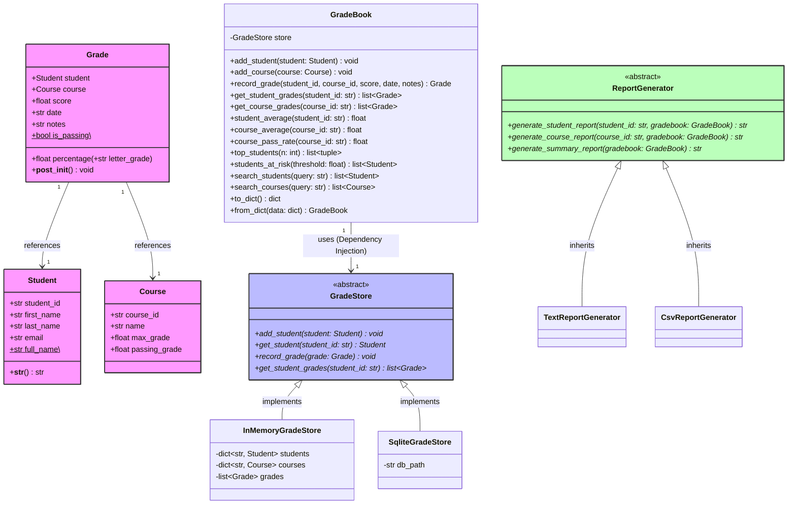

```mermaid
classDiagram
    direction topDown

    %% --- DOMAIN MODELS ---
    class Student {
        +str student_id
        +str first_name
        +str last_name
        +str email
        +str full_name\$
        +__str__() str
    }

    class Course {
        +str course_id
        +str name
        +float max_grade
        +float passing_grade
    }

    class Grade {
        +Student student
        +Course course
        +float score
        +str date
        +str notes
        +bool is_passing\$
        +float percentage\(+str letter_grade\)
        +__post_init__() void
    }

    %% --- STORAGE INTERFACES & IMPLEMENTATIONS ---
    class GradeStore {
        <<abstract>>
        +add_student(student: Student)* void
        +get_student(student_id: str)* Student
        +record_grade(grade: Grade)* void
        +get_student_grades(student_id: str)* list~Grade~
    }

    class InMemoryGradeStore {
        -dict~str, Student~ students
        -dict~str, Course~ courses
        -list~Grade~ grades
    }

    class SqliteGradeStore {
        -str db_path
    }

    %% --- MAIN APPLICATION CONTROLLER ---
    class GradeBook {
        -GradeStore store
        +add_student(student: Student) void
        +add_course(course: Course) void
        +record_grade(student_id, course_id, score, date, notes) Grade
        +get_student_grades(student_id: str) list~Grade~
        +get_course_grades(course_id: str) list~Grade~
        +student_average(student_id: str) float
        +course_average(course_id: str) float
        +course_pass_rate(course_id: str) float
        +top_students(n: int) list~tuple~
        +students_at_risk(threshold: float) list~Student~
        +search_students(query: str) list~Student~
        +search_courses(query: str) list~Course~
        +to_dict() dict
        +from_dict(data: dict) GradeBook
    }

    %% --- REPORT GENERATION ---
    class ReportGenerator {
        <<abstract>>
        +generate_student_report(student_id: str, gradebook: GradeBook)* str
        +generate_course_report(course_id: str, gradebook: GradeBook)* str
        +generate_summary_report(gradebook: GradeBook)* str
    }

    class TextReportGenerator {
    }

    class CsvReportGenerator {
    }

    %% --- RELATIONSHIPS & INHERITANCE ---
    Grade "1" --> "1" Student : references
    Grade "1" --> "1" Course : references
    
    GradeStore <|-- InMemoryGradeStore : implements
    GradeStore <|-- SqliteGradeStore : implements
    
    GradeBook "1" --> "1" GradeStore : uses (Dependency Injection)
    
    ReportGenerator <|-- TextReportGenerator : inherits
    ReportGenerator <|-- CsvReportGenerator : inherits

    %% --- STYLING ---
    style Student fill:#f9f,stroke:#333,stroke-width:2px
    style Course fill:#f9f,stroke:#333,stroke-width:2px
    style Grade fill:#f9f,stroke:#333,stroke-width:2px
    style GradeStore fill:#bbf,stroke:#333,stroke-width:2px
    style ReportGenerator fill:#bfb,stroke:#333,stroke-width:2px
```